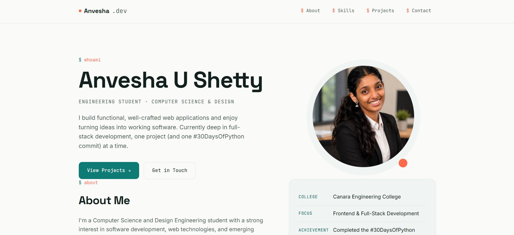

# Anvesha U Shetty — Personal Portfolio

A responsive personal portfolio website showcasing my skills, projects, interests, and contact information — my digital résumé.

## 🔗 Live Demo

**Live Site:**  https://anvesha-portfolio.netlify.app

## 📸 Preview

Add a screenshot of the portfolio here after completing the design:



## ✨ Features

- 👩‍💻 **Hero Section** — Name, professional role, and profile photo
- 📝 **About Me** — Short introduction covering background and interests
- 🛠️ **Skills Section** — Clean, scannable grid of technical skills
- 📂 **Projects Section** — Project cards with descriptions and GitHub links
- 📬 **Contact Section** — Email, LinkedIn, and GitHub
- 🧭 **Smooth Navigation** — Smooth scrolling between portfolio sections
- 🎨 **Consistent Design** — Unified color palette, typography, spacing, and components
- 📱 **Responsive Layout** — Optimized for desktop, tablet, and mobile screens
- ✨ **Progressive Enhancements** — JavaScript-powered scroll animations and active navigation highlighting

## 🛠️ Tech Stack

| Technology | Purpose |
|---|---|
| **HTML5** | Semantic website structure |
| **CSS3** | Styling, Flexbox, Grid, custom properties, and responsive media queries |
| **JavaScript** | Smooth scrolling, active navigation highlighting, and scroll-reveal animations |
| **Google Fonts** | Space Grotesk, Inter, and JetBrains Mono |

> JavaScript is used only for progressive enhancements; the core portfolio remains functional with HTML and CSS.

## 📁 Project Structure

```text
personal-portfolio/
│
├── index.html
├── assets/
│   └── image.png
├── profile.html
└── README.md
```

## 📌 Portfolio Sections

The website includes the following sections:

### Home
Introduces me as a Computer Science and Design Engineering student and aspiring software engineer.

### About
A brief overview of my academic background, interests, and career direction.

### Skills
Technical skills including programming languages, web technologies, backend technologies, databases, and development tools.

### Projects
Selected academic and personal projects demonstrating practical application of programming and web development skills.

### Contact
Professional contact information and links to my GitHub and LinkedIn profiles.

## 📬 Contact

**Anvesha U Shetty**

- **Email:** shettyanvesha11@gmail.com
- **LinkedIn:** https://www.linkedin.com/in/anvesha-shetty-45321732b/
- **GitHub:** https://github.com/AnveshaShetty

## 🎯 Project Objective

This portfolio was created as part of an internship task to demonstrate:

- Semantic HTML5 structure
- Modern CSS3 styling
- Responsive web design
- Basic JavaScript enhancements
- UI/UX consistency
- Git and GitHub workflow
- Ability to present technical projects professionally

## 📄 License

This project is created for personal portfolio and educational purposes.

© 2026 Anvesha U Shetty. All rights reserved.
