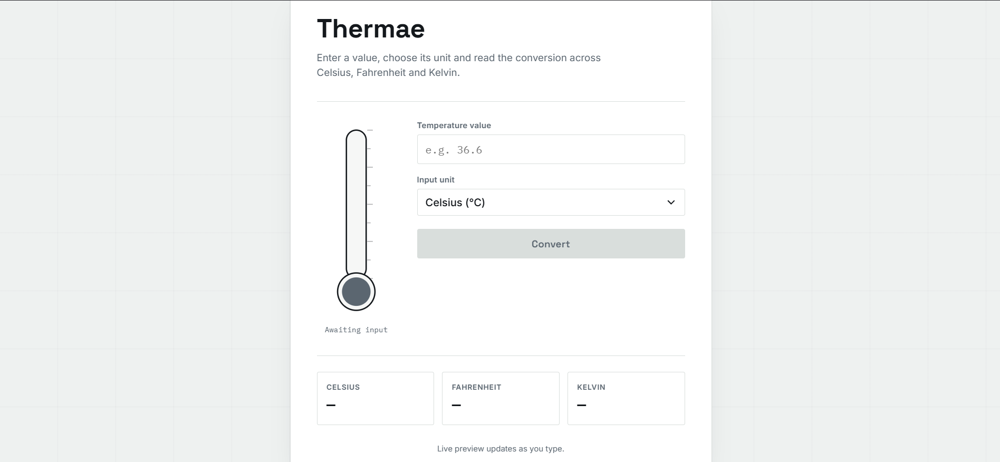

# 🌡️ Thermae — Temperature Converter

A clean, responsive temperature conversion web application that converts values between **Celsius, Fahrenheit, and Kelvin** with a real-time thermometer visualization.

🔗 **Live Demo:** https://temperature-converter-a.netlify.app

---

## 📸 Preview



---

## ✨ Features

- 🌡️ Convert between:
  - Celsius (°C)
  - Fahrenheit (°F)
  - Kelvin (K)
- ⚡ Live conversion preview while typing
- 🎨 Dynamic thermometer visualization
- 🔒 Prevents temperatures below absolute zero
- ✅ Input validation for numeric values
- ⚠️ Clear error and warning messages
- 🕒 Displays the conversion time after confirmation
- 📱 Responsive design for mobile and desktop
- ♿ Supports reduced-motion preferences
- 🎯 Highlights the selected input unit

---

## 🛠️ Technologies Used

- **HTML5** — Structure and semantic markup
- **CSS3** — Styling, responsive layout, animations and visual design
- **JavaScript (ES6+)** — Conversion logic, validation and dynamic UI updates
- **SVG** — Interactive thermometer visualization
- **Google Fonts**
  - Space Grotesk
  - Inter
  - IBM Plex Mono

---

## 🔄 Temperature Conversions

The application internally converts every input value to Celsius before calculating the other units.

### Celsius → Fahrenheit

```text
°F = (°C × 9/5) + 32
